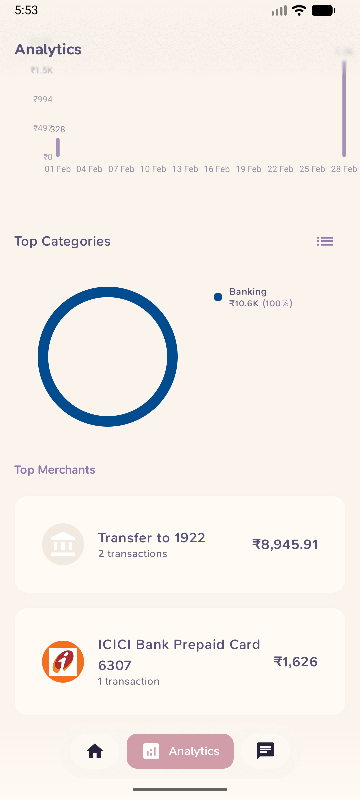
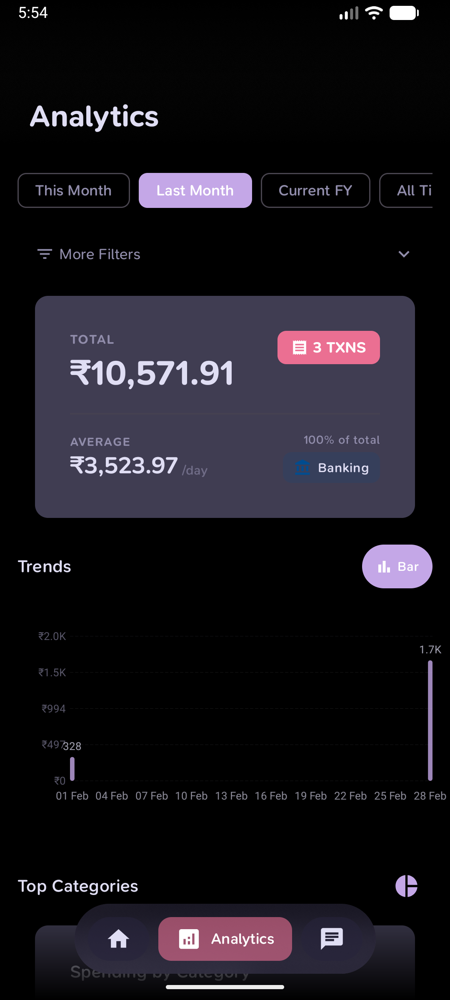
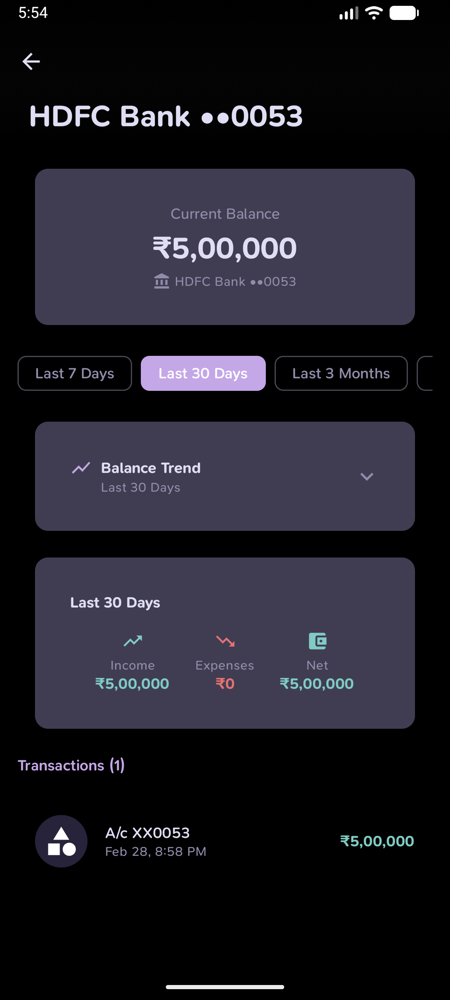
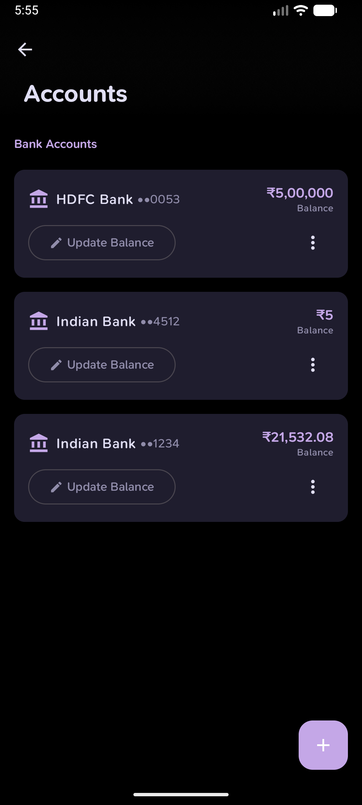
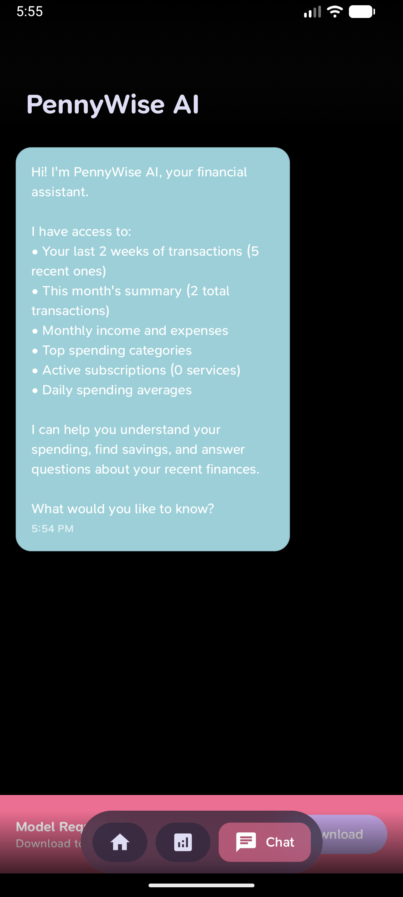

# Cashiro

SMS-first expense tracker for Android (UAE banks, AED), based on [PennyWise AI](https://github.com/sarim2000/pennywiseai-tracker), with Cashiro visuals and **one-way Firefly III** sync.

It reads bank SMS on the device and can push parsed transactions to your self-hosted Firefly III instance. AI chat is bring-your-own-key (OpenAI, Anthropic, Gemini, Groq, OpenRouter, xAI) — nothing is downloaded onto the phone.

## Firefly III

Opt-in, off by default. Settings → **Firefly III**.

1. Grant SMS permission (same as stock PennyWise).
2. Enter your Firefly URL and a Personal Access Token.
3. Map Cashiro accounts/categories to Firefly assets/categories (pulled from your instance).
4. New SMS (and manual adds) are pushed automatically when sync is enabled.
5. Failed pushes sit in a retry queue. Transaction detail has Sync / Retry.

`external_id` is `pennywise-{transactionHash}` so reinstalls can reconcile. Resync all creates missing journals and updates only Cashiro-owned ones. Firefly-native transactions are never imported or overwritten.

PAT is stored in EncryptedSharedPreferences, not backups.

Default look: branded Cashiro peach/cream (Rose accent `#E25C0E`, cream surfaces `#F4EBE3`, sunset cover).
Default currency is AED. Dynamic Material You color is off on first run.

---

<a name="top"></a>
[](https://github.com/sarim2000/pennywiseai-tracker)
[](https://github.com/sarim2000/pennywiseai-tracker)
[](LICENSE)
[](https://developer.android.com/about/versions/oreo/android-8.0)
[](https://kotlinlang.org/)
[](https://ai.google.dev/edge)
[](https://play.google.com/store/apps/details?id=com.pennywiseai.tracker)
[](https://f-droid.org/packages/com.pennywiseai.tracker/)
[](https://github.com/sarim2000/pennywiseai-tracker/releases)
[](https://github.com/sarim2000/pennywiseai-tracker/commits)
[](https://discord.gg/H3xWeMWjKQ)
[](https://www.greptile.com/?utm_source=oss_badge&utm_medium=readme&utm_campaign=greptile_for_open_source)

## PennyWise AI — Free & Open‑Source, private SMS‑powered expense tracker

Turn bank SMS into a clean, searchable money timeline with on-device AI assistance. Parsing, storage, and AI all run on your phone.


⭐ **Star us on GitHub — join 300+ supporters!**

[](https://x.com/intent/tweet?text=Check%20out%20PennyWise%20AI%20-%20Privacy-first%20expense%20tracker%20with%20on-device%20AI:%20https://github.com/sarim2000/pennywiseai-tracker%20%23Android%20%23PrivacyFirst%20%23OnDeviceAI)
[](https://www.linkedin.com/sharing/share-offsite/?url=https://github.com/sarim2000/pennywiseai-tracker)
[](https://www.reddit.com/submit?title=PennyWise%20AI%20-%20Privacy-first%20expense%20tracker&url=https://github.com/sarim2000/pennywiseai-tracker)
[](https://t.me/share/url?url=https://github.com/sarim2000/pennywiseai-tracker&text=Check%20out%20PennyWise%20AI)

## Overview

Your bank already texts you every transaction — PennyWise turns those SMS into a private, zero-setup expense tracker with on-device AI. No accounts, no sign-ups, no effort.

<a href="https://play.google.com/store/apps/details?id=com.pennywiseai.tracker">
  
</a>
<a href="https://apps.apple.com/app/id6793073167">
  
</a>
<a href="https://f-droid.org/packages/com.pennywiseai.tracker">
  
</a>

### How it works

1. **Grant SMS permission** (read-only) — no account creation, no inbox changes, no messages sent.
2. **PennyWise parses your transactions instantly** — extracts amount, merchant, category, and date. New SMS are detected in real-time.
3. **Get insights** — analytics, budgets, subscriptions, and an on-device AI assistant you can ask anything.

## Why PennyWise

**Key Differentiators**

- **🔒 Private by Design** — All AI processing and transaction storage happen on your phone; no accounts, no analytics, no servers collecting your data
- **⚡ Zero Setup** — Just grant SMS permission, no accounts to create, works instantly
- **🆓 Free & Open Source** — AGPL v3 licensed, no ads, no trackers; an optional **PennyWise Pro** upgrade (unlimited rules, PDF statement imports, CSV export, account merge) supports the solo developer

**Core Features**

- **🤖 Smart SMS Parsing** — <!-- BANKS_SUMMARY -->153 banks across 23 countries<!-- /BANKS_SUMMARY --> with real-time detection of incoming SMS
- **🌍 Multi-Currency** — Native support for INR, USD, AED, THB, NPR, ETB, and more with exchange rate management
- **💬 On-Device AI Assistant** — Ask "What did I spend on food?" — powered by Qwen 2.5, runs entirely on your phone
- **🏷️ Auto-Categorization & Smart Rules** — Pattern-based rules that auto-categorize transactions
- **💰 Budget Tracking** — Multiple budget groups (Limit/Target/Expected types), daily allowance, category-level budgets
- **📊 Analytics & Charts** — Bar charts, line trends, heatmaps, category breakdowns, top merchants, custom date ranges
- **🏦 Multi-Account & Balance Tracking** — Track multiple bank accounts with live balance from SMS and balance history
- **🔄 Subscription Detection** — Automatic recurring payment detection with due date alerts
- **🎨 Custom Categories** — Create your own with custom colors and icons

**More Features**

- **🔐 Biometric App Lock** — Fingerprint/face unlock with configurable timeout
- **📱 Home Screen Widgets** — Budget progress and recent transactions at a glance
- **📤 Data Export & Backup** — CSV export for taxes, full backup/restore (.pennywisebackup)
- **🎭 Material You Theming** — Dynamic colors, multiple cover styles (Aurora, Gradient, Wave), light/dark/system themes
- **✏️ Manual Transactions** — Add and edit transactions manually
- **🔍 Search & Filters** — Filter by category, merchant, period, currency, transaction type
- **🎯 Guided Onboarding** — Spotlight tutorial for first-time users

### Smart Rules Engine

Rules let you auto-categorize, modify, or block transactions based on configurable **conditions**. A rule consists of one or more "When" conditions and a "Then" action.

**Available condition fields:**

| Field | Description | Example value | Supported operators |
|---|---|---|---|
| `AMOUNT` | Transaction amount | `200` | `<`, `>`, `=` |
| `TYPE` | Income/Expense/Transfer | `INCOME` | `contains`, `equals`, `starts with` |
| `CATEGORY` | Assigned category | `Food & Dining` | `contains`, `equals`, `starts with` |
| `MERCHANT` | Merchant/vendor name | `Amazon` | `contains`, `equals`, `starts with` |
| `NARRATION` | Transaction description | `Monthly rent` | `contains`, `equals`, `starts with` |
| `SMS_TEXT` | Raw SMS body | `OTP` | `contains`, `equals`, `starts with` |
| `BANK_NAME` | Bank name from SMS | `HDFC Bank` | `contains`, `equals`, `starts with` |
| `TIME` / `HOUR` | Transaction time | `09:00` / `9` | `before`, `after`, `at or after`, `at or before` |
| `DAY_OF_WEEK` | Day (1=Mon .. 7=Sun) | `1` | `is`, `is any of`, `is not` |
| `DAY_OF_MONTH` | Day of month (1-31) | `15` | `is`, `is any of`, `before`, `after` |
| `DATE` | Transaction date | `2026-03-21` | `is`, `before`, `after` |
| **`ACCOUNT`** | **Bank account composite** | Select from picker | `is`, `is not` |

**Account condition (ACCOUNT)** — Restricts the rule to transactions from a specific bank account. The value is stored as a `BankName||Last4` composite key (e.g. `HDFC Bank||1234`). When selected, the UI shows an account picker populated from your tracked accounts. Only `EQUALS` and `NOT_EQUALS` operators are available.

Conditions can be combined with **AND** / **OR** logic, and multiple conditions per rule are supported.

**Available actions:**
- **Set** — Override a field (category, merchant, type, description)
- **Append / Prepend** — Add text to a field (merchant, description)
- **Clear** — Remove a field value
- **Block** — Prevent the transaction from being saved

**JSON representation** (stored locally, not exposed via API):
```json
{
  "conditions": [
    {"field": "ACCOUNT", "operator": "EQUALS", "value": "HDFC Bank||1234"},
    {"field": "AMOUNT", "operator": "GREATER_THAN", "value": "500"}
  ],
  "actions": [
    {"field": "CATEGORY", "actionType": "SET", "value": "Food & Dining"}
  ]
}
```

## Supported Banks & Countries

<!-- SUPPORTED_BANKS:START (generated by scripts/update-supported-banks.sh — do not edit by hand) -->
Supporting **153 banks & services** across **23 countries** with **multi-currency** capabilities:

### 🇮🇳 India — INR ₹ (54)
**AU Small Finance Bank**, **Airtel Payments Bank**, **Amazon Pay**, **American Express**, **Axis Bank**, **Bandhan Bank**, **Bank of Baroda**, **Bank of India**, **CRED**, **Canara Bank**, **Cashfree**, **Central Bank of India**, **City Union Bank**, **DBS Bank**, **Department of Post**, **Dhanlaxmi Bank**, **Equitas Small Finance Bank**, **Federal Bank**, **Greater Bank**, **HDFC Bank**, **HDFC Mutual Fund**, **HSBC Bank**, **ICICI Bank**, **IDBI Bank**, **IDFC First Bank**, **India Post Payments Bank**, **Indian Bank**, **Indian Overseas Bank**, **IndusInd Bank**, **JK Bank**, **Jana Small Finance Bank**, **Jio Payments Bank**, **JioPay**, **Jupiter**, **Karnataka Bank**, **Kerala Bank**, **Kerala Gramin Bank**, **Kotak Bank**, **LazyPay**, **NSDL Payments Bank**, **Navi Mutual Fund**, **OneCard**, **Pluxee**, **Punjab & Sind Bank**, **Punjab National Bank**, **Saraswat Co-operative Bank**, **Slice**, **South Indian Bank**, **Standard Chartered Bank**, **State Bank of India**, **UCO Bank**, **Union Bank of India**, **Utkarsh Bank**, **Yes Bank**

### 🇳🇵 Nepal — NPR ₨ (13)
**Citizens Bank**, **Everest Bank**, **Laxmi Sunrise Bank**, **Lumbini Bikash Bank**, **Machchhapuchchhre Bank**, **Manjushree Finance**, **NMB Bank**, **Nabil Bank**, **Nepal Bank Limited**, **Nepal SBI Bank**, **Prime Commercial Bank**, **Siddhartha Bank**, **Standard Chartered Bank Nepal**

### 🇹🇭 Thailand — THB ฿ (11)
**BAAC**, **Bangkok Bank**, **CIMB Thai**, **Government Savings Bank**, **KTC**, **Kasikorn Bank**, **Krungsri**, **Krungthai Bank**, **Siam Commercial Bank**, **TTB**, **UOB Thailand**

### 🇺🇸 United States — USD $ (10)
**ALECU**, **AdelFi**, **Altana Federal Credit Union**, **Charles Schwab**, **Chase**, **Citi Bank**, **Discover Card**, **Huntington Bank**, **Navy Federal Credit Union**, **Old Hickory Credit Union**

### 🇪🇹 Ethiopia — ETB ብር (9)
**Apollo**, **Awash Bank**, **Bank of Abyssinia**, **Commercial Bank of Ethiopia**, **Dashen Bank**, **Siket Bank**, **Telebirr**, **ZamZam Bank**, **Zemen Bank**

### 🇳🇬 Nigeria — NGN ₦ (9)
**Access Bank**, **GTBank**, **Jaiz Bank**, **Keystone Bank**, **Moniepoint**, **Opay**, **Standard Chartered Bank Nigeria**, **VFD Microfinance Bank**, **Zenith Bank**

### 🇸🇦 Saudi Arabia — SAR ﷼ (7)
**Al Rajhi Bank**, **Alinma Bank**, **Banque Saudi Fransi**, **D360 Bank**, **SABB**, **STC Bank**, **Saudi National Bank**

### 🇹🇿 Tanzania — TZS TSh (7)
**CRDB Bank**, **Diamond Trust Bank**, **M-Pesa Tanzania**, **Mixx by Yas**, **NMB Bank Tanzania**, **Selcom Pesa**, **Tigo Pesa**

### 🇮🇷 Iran — IRR ﷼ (6)
**Bankino**, **Mellat Bank**, **Melli Bank**, **Parsian Bank**, **Pasargad Bank**, **blu Bank**

### 🇦🇪 UAE — AED د.إ (6)
**Abu Dhabi Commercial Bank**, **Emirates Islamic**, **Emirates NBD**, **First Abu Dhabi Bank**, **Liv Bank**, **Mashreq Bank**

### 🇲🇿 Mozambique — MZN MT (4)
**M-Pesa Mozambique**, **Millennium BIM**, **Standard Bank Mozambique**, **eMola**

### 🇱🇰 Sri Lanka — LKR Rs (4)
**National Development Bank**, **National Savings Bank**, **Nations Trust Bank**, **Sampath Bank**

### 🇪🇬 Egypt — EGP E£ (2)
**Arab Bank**, **CIB Egypt**

### 🇪🇺 Eurozone — EUR € (2)
**BPCE**, **Sparkasse Rhein-Maas**

### 🇧🇩 Bangladesh — BDT ৳ (1)
**bKash**

### 🇧🇾 Belarus — BYN Br (1)
**Priorbank**

### 🇨🇴 Colombia — COP $ (1)
**Bancolombia**

### 🇨🇿 Czech Republic — CZK Kč (1)
**mBank CZ**

### 🇰🇪 Kenya — KES Ksh (1)
**M-PESA**

### 🇴🇲 Oman — OMR ر.ع. (1)
**Bank Muscat**

### 🇵🇰 Pakistan — PKR ₨ (1)
**Faysal Bank**

### 🇷🇺 Russia — RUB ₽ (1)
**T-Bank**

### 🇹🇷 Turkey — TRY ₺ (1)
**Enpara**
<!-- SUPPORTED_BANKS:END -->

More banks being added regularly! [Request your bank →](https://github.com/sarim2000/pennywiseai-tracker/issues/new?template=bank_support_request.md)

## Privacy First

All AI processing happens on your device, powered by Google AI Edge LiteRT-LM running Qwen 2.5. Your SMS and transactions are parsed, stored, and analyzed **locally** — there are no accounts, **no analytics, crash-reporting, or telemetry SDKs** (no Firebase / Crashlytics / Sentry / Google Analytics — verify in `app/build.gradle.kts`), and no PennyWise server ever receives your financial data. The whole codebase is open source (AGPL v3) so every claim below is checkable.

### Network access — every outbound call the app can make

1. **Google Play services** *(Play Store build only)* — Google Play Billing (optional Pro subscription), In-App Updates, and In-App Review. These are Google's SDKs (declared `standardImplementation`), and they do their own background connectivity to Google — this is the most likely source of any "background data" you notice, especially on a single-currency setup. **The [F-Droid](https://f-droid.org/) build strips all three and is fully Google-free.**
2. **Exchange rates** — fetched from `open.er-api.com`. Automatic currency conversion runs **only when you hold more than one currency** (same-currency conversions make no call), but opening the currency picker also fetches the current rate list. Either way the request carries just a 3-letter currency code and a static `User-Agent` — no SMS, transactions, or device identifier — and results are cached locally. (`ExchangeRateProvider.kt`)
3. **On-device AI model** — a one-time ~1.5 GB download from Cloudflare R2, **only if you open the AI chat and choose to download it**. The bytes are SHA-256 pinned; after that the AI runs 100% offline. (`Constants.MODEL_URL`)
4. **Report a parsing problem** — when you use this flow it opens `pennywise.zynth.dev` with the SMS text, its sender, and an RSA-encrypted device identifier (your Android ID plus a timestamp) pre-filled, and parses them server-side to show a preview. Nothing is sent unless you start this yourself. (`SmsReportUrlBuilder.kt`, `DeviceEncryption.kt`)
5. **Links** (Discord, GitHub, Play Store, backup docs) open your browser — no background data.

Everything else stays on your phone.

## Screenshots

<p align="center">
  
  
  
  
  
  
</p>

<details>
<summary>In-app screenshots (light &amp; dark themes)</summary>

<br/>

**Light Theme**

<table>
<tr>
<td></td>
<td></td>
<td></td>
<td></td>
<td></td>
</tr>
<tr>
<td align="center">Home</td>
<td align="center">Analytics</td>
<td align="center">Categories</td>
<td align="center">Details</td>
<td align="center">AI Chat</td>
</tr>
</table>

**Dark Theme**

<table>
<tr>
<td></td>
<td></td>
<td></td>
<td></td>
<td></td>
</tr>
<tr>
<td align="center">Home</td>
<td align="center">Analytics</td>
<td align="center">Account Detail</td>
<td align="center">Accounts</td>
<td align="center">AI Chat</td>
</tr>
</table>

</details>

## Quick Start

```bash
# Clone repository
git clone https://github.com/sarim2000/pennywiseai-tracker.git
cd pennywiseai-tracker

# Environment check + fast test gate (same compile/test tasks CI runs)
./init.sh

# Build APK
./gradlew assembleDebug

# Install
adb install app/build/outputs/apk/standard/debug/app-standard-universal-debug.apk
```

### Requirements

- Android 8.0+ (API 26)
- Android Studio Ladybug or newer
- JDK 21

## Tech Stack

<p align="center">
  <br>
  
</p>

**Architecture**: MVVM • Jetpack Compose • Room • Coroutines • Hilt • Google AI Edge (on-device LLM) • Material Design 3

## Community & Support

- **Discord**: Join the community, share feedback, and get help — [Join Discord](https://discord.gg/H3xWeMWjKQ)
- **Issues**: Report bugs or request features — [Open an issue](https://github.com/sarim2000/pennywiseai-tracker/issues)

## Contributing

See [CONTRIBUTING.md](CONTRIBUTING.md) for guidelines.

Please read our [Code of Conduct](CODE_OF_CONDUCT.md) before participating.

```bash
./gradlew test          # Run tests
./gradlew lint   # Check style
```

## Security

Please review our [Security Policy](SECURITY.md) for how to report vulnerabilities.

## Contributors ✨

Thanks goes to these wonderful people ([emoji key](https://allcontributors.org/docs/en/emoji-key)):

<!-- ALL-CONTRIBUTORS-LIST:START - Do not remove or modify this section -->
<!-- prettier-ignore-start -->
<!-- markdownlint-disable -->
<table>
  <tbody>
    <tr>
      <td align="center" valign="top" width="14.28%"><a href="https://github.com/Lucifer1590"><br /><sub><b>Lucifer1590</b></sub></a><br /><a href="#community-Lucifer1590" title="Community Management">👥</a> <a href="https://github.com/sarim2000/pennywiseai-tracker/issues?q=author%3ALucifer1590" title="Bug reports">🐛</a> <a href="#userTesting-Lucifer1590" title="User Testing">📓</a></td>
      <td align="center" valign="top" width="14.28%"><a href="https://github.com/akshaynexus"><br /><sub><b>akshaynexus</b></sub></a><br /><a href="https://github.com/sarim2000/pennywiseai-tracker/commits?author=akshaynexus" title="Code">💻</a></td>
      <td align="center" valign="top" width="14.28%"><a href="https://github.com/WINDY-WINDWARD"><br /><sub><b>WINDY-WINDWARD</b></sub></a><br /><a href="https://github.com/sarim2000/pennywiseai-tracker/commits?author=WINDY-WINDWARD" title="Code">💻</a></td>
      <td align="center" valign="top" width="14.28%"><a href="https://github.com/brukberhane"><br /><sub><b>brukberhane</b></sub></a><br /><a href="https://github.com/sarim2000/pennywiseai-tracker/commits?author=brukberhane" title="Code">💻</a></td>
      <td align="center" valign="top" width="14.28%"><a href="https://github.com/KaushalJyanni"><br /><sub><b>KaushalJyanni</b></sub></a><br /><a href="https://github.com/sarim2000/pennywiseai-tracker/commits?author=KaushalJyanni" title="Code">💻</a></td>
      <td align="center" valign="top" width="14.28%"><a href="https://github.com/cmazwar"><br /><sub><b>cmazwar</b></sub></a><br /><a href="https://github.com/sarim2000/pennywiseai-tracker/commits?author=cmazwar" title="Code">💻</a></td>
      <td align="center" valign="top" width="14.28%"><a href="https://github.com/AyonPal"><br /><sub><b>AyonPal</b></sub></a><br /><a href="https://github.com/sarim2000/pennywiseai-tracker/commits?author=AyonPal" title="Code">💻</a></td>
    </tr>
    <tr>
      <td align="center" valign="top" width="14.28%"><a href="https://github.com/rafi-ghanbari"><br /><sub><b>rafi-ghanbari</b></sub></a><br /><a href="https://github.com/sarim2000/pennywiseai-tracker/commits?author=rafi-ghanbari" title="Code">💻</a></td>
      <td align="center" valign="top" width="14.28%"><a href="https://github.com/Chevindu"><br /><sub><b>Chevindu</b></sub></a><br /><a href="https://github.com/sarim2000/pennywiseai-tracker/commits?author=Chevindu" title="Code">💻</a></td>
      <td align="center" valign="top" width="14.28%"><a href="https://github.com/arunpdl"><br /><sub><b>arunpdl</b></sub></a><br /><a href="https://github.com/sarim2000/pennywiseai-tracker/commits?author=arunpdl" title="Code">💻</a></td>
      <td align="center" valign="top" width="14.28%"><a href="https://github.com/hegdenischay"><br /><sub><b>hegdenischay</b></sub></a><br /><a href="https://github.com/sarim2000/pennywiseai-tracker/commits?author=hegdenischay" title="Code">💻</a></td>
      <td align="center" valign="top" width="14.28%"><a href="https://github.com/shreyes-shalgar"><br /><sub><b>shreyes-shalgar</b></sub></a><br /><a href="https://github.com/sarim2000/pennywiseai-tracker/issues?q=author%3Ashreyes-shalgar" title="Bug reports">🐛</a></td>
      <td align="center" valign="top" width="14.28%"><a href="https://github.com/test2a"><br /><sub><b>test2a</b></sub></a><br /><a href="https://github.com/sarim2000/pennywiseai-tracker/issues?q=author%3Atest2a" title="Bug reports">🐛</a></td>
      <td align="center" valign="top" width="14.28%"><a href="https://github.com/AlphaXyph"><br /><sub><b>AlphaXyph</b></sub></a><br /><a href="https://github.com/sarim2000/pennywiseai-tracker/issues?q=author%3AAlphaXyph" title="Bug reports">🐛</a></td>
    </tr>
    <tr>
      <td align="center" valign="top" width="14.28%"><a href="https://github.com/kamranbahrami261-beep"><br /><sub><b>kamranbahrami261-beep</b></sub></a><br /><a href="https://github.com/sarim2000/pennywiseai-tracker/issues?q=author%3Akamranbahrami261-beep" title="Bug reports">🐛</a></td>
      <td align="center" valign="top" width="14.28%"><a href="https://github.com/jerryn70"><br /><sub><b>jerryn70</b></sub></a><br /><a href="https://github.com/sarim2000/pennywiseai-tracker/issues?q=author%3Ajerryn70" title="Bug reports">🐛</a></td>
      <td align="center" valign="top" width="14.28%"><a href="https://github.com/albert-godinho"><br /><sub><b>albert-godinho</b></sub></a><br /><a href="https://github.com/sarim2000/pennywiseai-tracker/issues?q=author%3Aalbert-godinho" title="Bug reports">🐛</a></td>
      <td align="center" valign="top" width="14.28%"><a href="https://github.com/Mikcharls311"><br /><sub><b>Mikcharls311</b></sub></a><br /><a href="https://github.com/sarim2000/pennywiseai-tracker/issues?q=author%3AMikcharls311" title="Bug reports">🐛</a></td>
      <td align="center" valign="top" width="14.28%"><a href="https://github.com/rhsjudb"><br /><sub><b>rhsjudb</b></sub></a><br /><a href="https://github.com/sarim2000/pennywiseai-tracker/issues?q=author%3Arhsjudb" title="Bug reports">🐛</a></td>
    </tr>
  </tbody>
</table>

<!-- markdownlint-restore -->
<!-- prettier-ignore-end -->

<!-- ALL-CONTRIBUTORS-LIST:END -->

This project follows the [all-contributors](https://github.com/all-contributors/all-contributors) specification. Contributions of any kind welcome!

## Star History

[](https://star-history.dera.page/#sarim2000/pennywiseai-tracker&type=date)

## License

GNU Affero General Public License v3.0 - see [LICENSE](LICENSE)

This project is licensed under AGPL v3, which means:
- ✅ You can use, modify, and distribute this software
- ✅ You must share your modifications under the same license
- ✅ If you run a modified version on a server, you must make the source code available to users
- ✅ Patent rights are explicitly granted and protected

---

<p align="center">
<a href="https://github.com/sarim2000/pennywiseai-tracker/releases">Download</a> •
<a href="https://apps.apple.com/app/id6793073167">iOS App</a> •
<a href="https://github.com/sarim2000/pennywiseai-tracker/issues">Report Bug</a> •
<a href="https://github.com/sarim2000/pennywiseai-tracker/issues">Request Feature</a>
</p>
