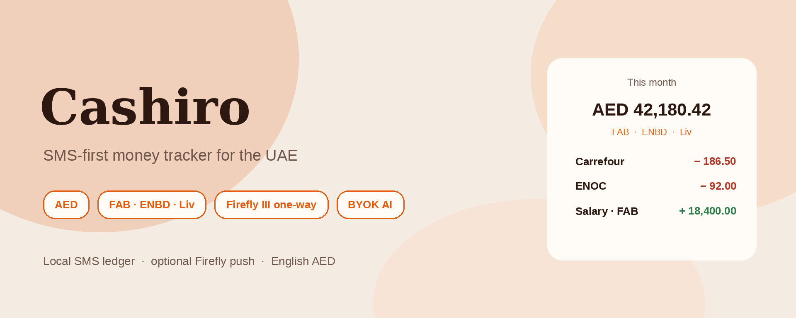
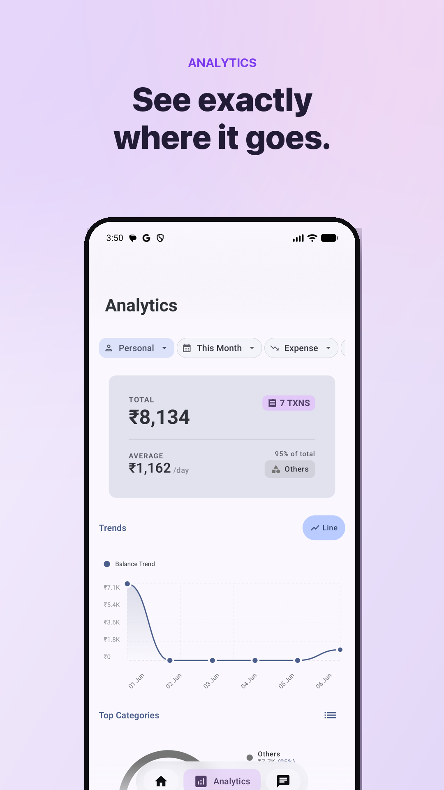
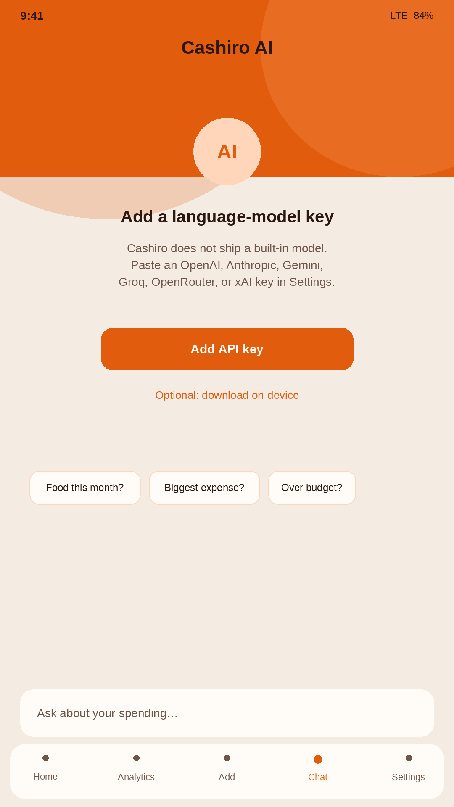
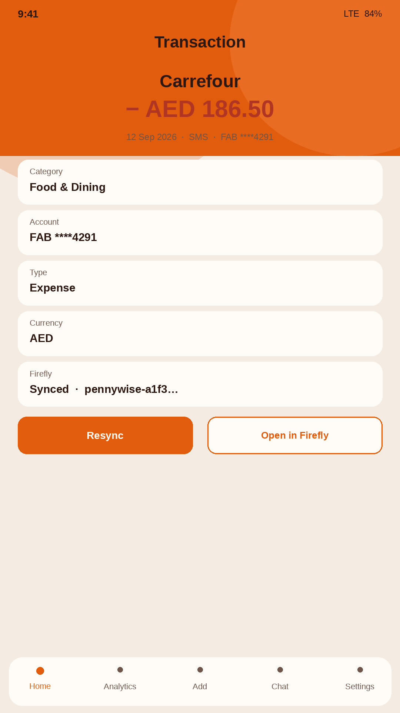
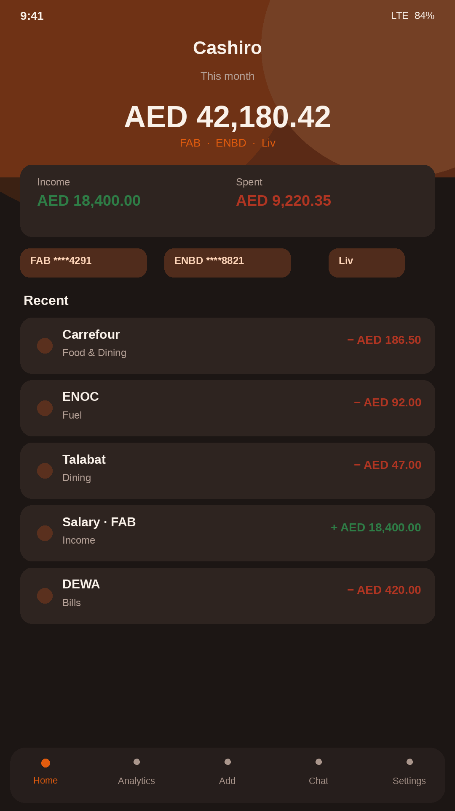
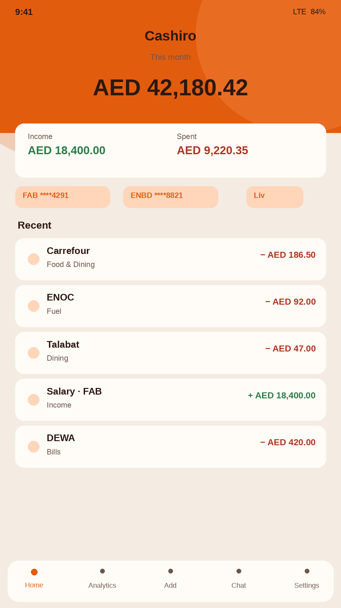
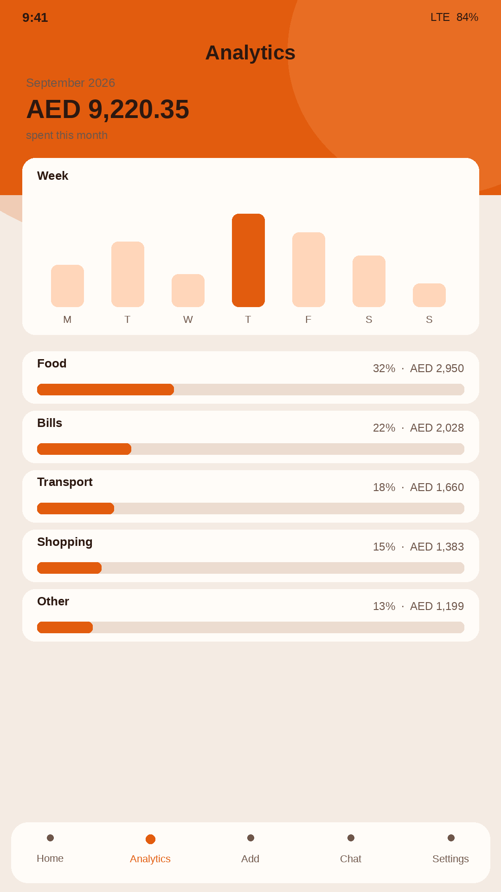
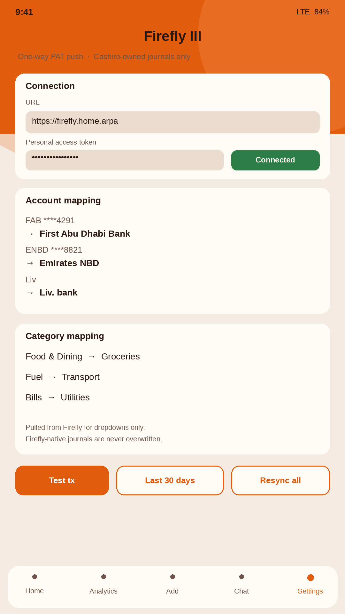

# Cashiro

SMS-first expense tracker for Android, tuned for **UAE banks and AED**.
This app was vibe coded. Do not trust it.

It reads bank SMS on the phone, builds a local ledger, and can **push** those transactions one-way to your self-hosted [Firefly III](https://www.firefly-iii.org/) instance. English uses Latin `AED 42,180.42` — not `د.إ` or Eastern Arabic digits. AI is **bring-your-own-key**.

[](https://github.com/xPsIXx/cashiro)

[](https://github.com/xPsIXx/cashiro/releases)
[](https://github.com/xPsIXx/cashiro/commits)
[](LICENSE)
[](https://developer.android.com/about/versions/oreo/android-8.0)
[](https://kotlinlang.org/)

Built on [PennyWise AI](https://github.com/sarim2000/pennywiseai-tracker) with Firefly work from [Pennywiseai-Firefly](https://github.com/xPsIXx/Pennywiseai-Firefly). Default look is Cashiro peach/cream (rose `#E25C0E`, cream `#F4EBE3`). Default currency is **AED**.

## Screenshots

<p align="center">
  
  
  
  
  
  
</p>

<table>
<tr>
<td align="center"><br/>Home</td>
<td align="center"><br/>Analytics</td>
<td align="center"><br/>Firefly III</td>
<td align="center"><br/>BYOK AI</td>
<td align="center"><br/>Transaction</td>
</tr>
</table>

## How it works

1. Grant SMS permission (read-only). No account, no inbox changes, nothing sent.
2. Cashiro parses FAB, ENBD, Liv and other bank SMS into amount, merchant, category, and date.
3. Optionally connect Firefly III with a Personal Access Token and map accounts/categories.
4. Ask the AI about spending using **your** OpenAI, Anthropic, Gemini, Groq, OpenRouter, or xAI key.

## Firefly III

Opt-in, off by default. **Settings → Firefly III**.

| What | Behaviour |
| --- | --- |
| Direction | Phone → Firefly only |
| Lookup | `external_id_is:pennywise-{transactionHash}` |
| Missing | `POST` create (Cashiro-owned) |
| Already ours | `PUT` update that journal only |
| Firefly-native | skipped — never imported, never overwritten |
| Resync all | walk every local row; same rules; no duplicates |
| Mapping | GET `/accounts?type=asset` and `/categories` for dropdowns only |

PAT is stored in EncryptedSharedPreferences and is not included in backups.

## AI

No built-in model is required. Paste a provider key in Settings. On-device download remains optional.

## Features

- SMS parsing for UAE banks first (FAB, ENBD, Liv, ADCB, Mashreq, Emirates Islamic), plus the inherited parser set below
- English profile uses `AED` with Latin digits
- Budgets, analytics, subscriptions, smart rules, widgets, biometric lock
- Manual transactions, CSV export, local backup
- Light / dark / system theme; Material You optional (off on first run)

## Install

Debug APKs are published as artifacts on each green [Tests](https://github.com/xPsIXx/cashiro/actions/workflows/test.yml) run (`standard-debug-apk`).

Signed releases (when you run the **Release** workflow): [Releases](https://github.com/xPsIXx/cashiro/releases).

```bash
git clone https://github.com/xPsIXx/cashiro.git
cd cashiro
./gradlew assembleStandardDebug
adb install app/build/outputs/apk/standard/debug/*.apk
```

Android 8.0+ · JDK 21 · Android Studio.


## Privacy

- SMS, transactions, and budgets stay on the device.
- Firefly is the only optional push, and only after you paste a PAT.
- BYOK chat sends the prompt you type to **your** provider. No Cashiro server.
- No Firebase / Crashlytics / Sentry / Google Analytics.

Exchange rates still hit `open.er-api.com` when you hold more than one currency.

## Credits

- [PennyWise AI](https://github.com/sarim2000/pennywiseai-tracker) by [sarim2000](https://github.com/sarim2000) — parsers, Room ledger, Compose UI
- [Firefly III](https://www.firefly-iii.org/)

## License

[AGPL v3](LICENSE) — same as PennyWise AI.
